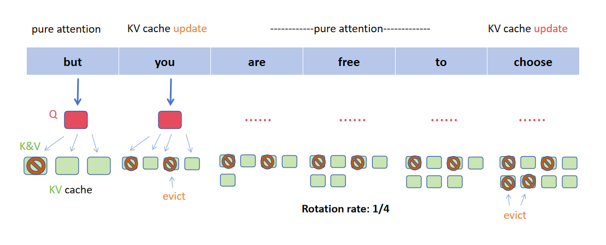

# H2Optimizer

H2Optimizer is a modified version of [H2O](https://github.com/meta-llama/llama-recipes/tree/main/recipes/experimental/long_context/H2O), focusing on further optimizing LLM attention computations. It serves as the main codebase for an NYU Shanghai CS Senior Project. See this [final report](https://drive.google.com/file/d/10qK5nrqpIJlVvzUl2J7gUW63xhfluDzf/view?usp=sharing) for principle explanation and experimental results.

## Copyright Notice

H2Optimizer is a derivative work based on H2O, which is licensed under the MIT License. It also utilizes and modifies components of Meta Llama 3, which are distributed under the Meta Llama 3 Community License. 

### License Attribution

- **H2O**: Licensed under the MIT License.
- **Meta Llama 3**: Licensed under the Meta Llama 3 Community License. See the full license agreement [here](https://github.com/meta-llama/llama-models/blob/main/models/llama3/LICENSE).

### Meta Llama 3 Attribution

This project includes modifications and use of **Meta Llama 3**. As required by the Meta Llama 3 Community License:
- Built with Meta Llama 3.
- Llama 3 is a trademark of Meta Platforms, Inc.

### Notice

Meta Llama 3 is licensed under the Meta Llama 3 Community License, Copyright © Meta Platforms, Inc. All Rights Reserved.

---

## Disclaimer

This project is provided "as is" without warranty of any kind, either express or implied, including but not limited to the implied warranties of merchantability and fitness for a particular purpose, as stated in the licenses of the respective dependencies (MIT License for H2O and Meta Llama 3 Community License for Llama 3).

---
## Modifications

### KV Cache Update

I wrote a fucntion called `update_slimmingH` to replace `update_slimming` in `utils/cache.py` with more effcient KV cache updates.

### Rotation Attention
I made KV cache update at a certain number of step intervals instead of each step in `llama.py`. I also added an optional Flash Attention module, which requires Flash Attention to be installed to run.

## Usage
This is an early release, and the variables within llama.py need to be adjusted to achieve different functions.
```
python run_summarization.py \
--input-path data/summarization/xsum.jsonl \
--output-path summarization_output/xsum_h2o.jsonl \
--model-name meta-llama/Meta-Llama-3-8B \
--enable_h2o_generation
```
See more details In [H2O](https://github.com/meta-llama/llama-recipes/tree/main/recipes/experimental/long_context/H2O) original framework.
